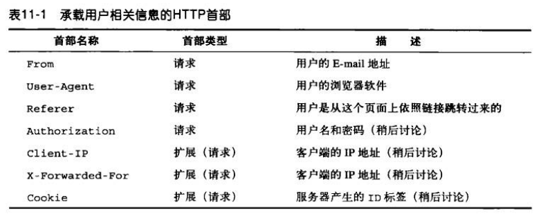

# 客户端识别与 cookie 机制
## HTTP 首部
下表列出了最常见的七种用来承载用户相关信息的 HTTP 首部。

From 首部可以用来发送用户的电子邮件地址，但服务器有可能会搜集这些信息来发垃圾邮件，所以很少浏览器会发送 From 首部。

User-Agent 首部可以将用户浏览器的相关信息发送给服务器。

Referer 首部提供了用户来源页面的 URL，根据它可以知道用户是从哪个页面跳过来的。

这三个首部都不能实现可靠的识别。

## 客户端的 IP 地址
使用客户端 IP 地址来识别用户存在很多缺点：
1. IP 地址描述的是机器，不是用户。如果多个用户共用一台机器，就无法对其进行区分了。
2. 很多 ISP 会在用户登录时为其分配动态 IP 地址，有可能用户每次登录都是不同的 IP 地址。
3. 很多用户都是通过网络地址转换 NAT 防火墙来浏览网络的。这些设备隐藏了用户真正的 IP 地址。
4. 客户的请求可能会经过很多网关或代理，导致服务器得到的是网关或代理的 IP 地址。