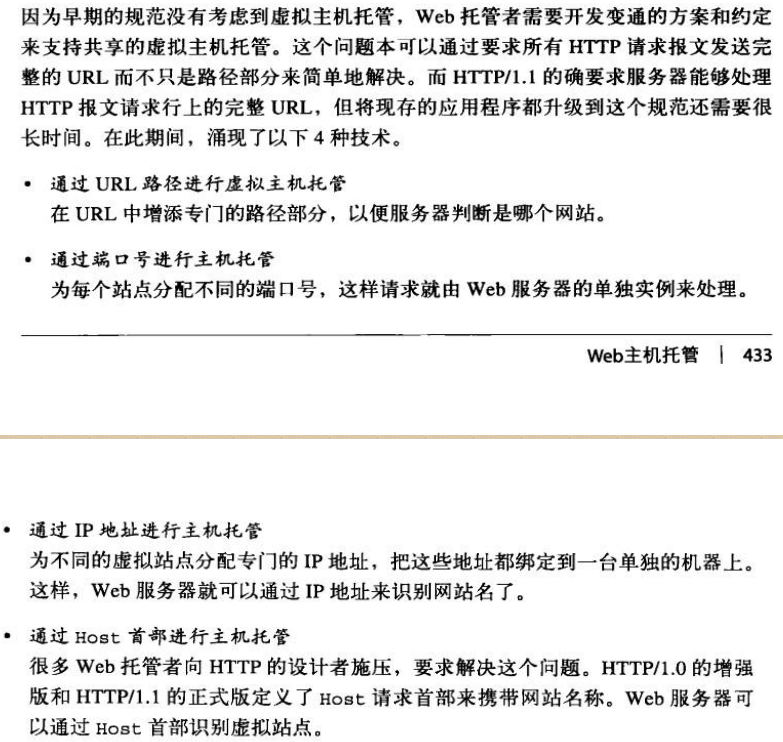
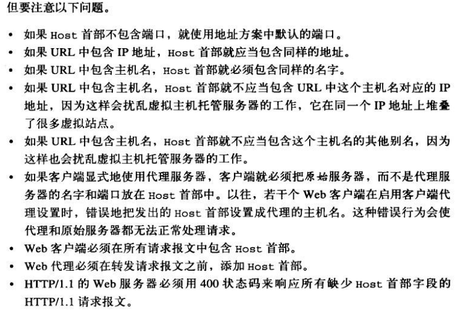
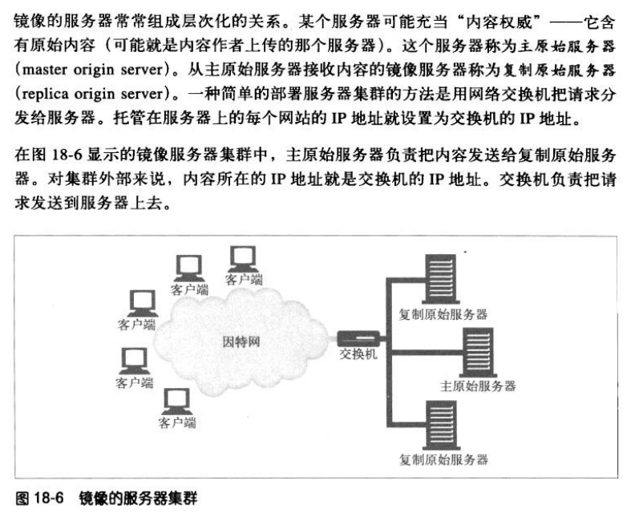
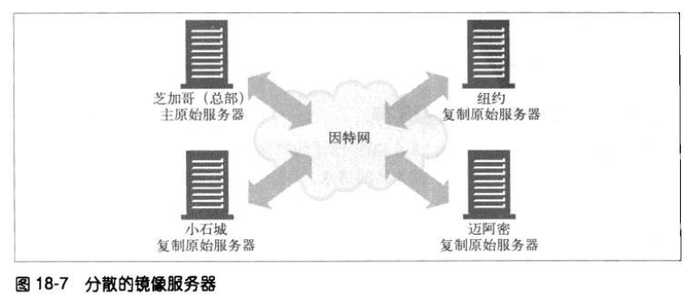

# Web 主机托管
对内容资源的存储、协调以及管理的职责统称为 **Web 主机托管**。
如果不想自行管理服务器所需的软硬件，就需要主机托管服务，即托管者。托管者出租服务和网站管理维护业务，并提供各种不同程度的安全级别、报告及易用性。

## 主机托管服务
用户向服务提供商租用 Web 服务器，就可以不用自己购买服务器并管理软件了。

## 虚拟主机托管
共享主机托管或虚拟主机托管就是让多个用户共享一台 Web 服务器。每个网站看起来是托管在不同的服务器上的，但实际上是托管在同一个物理服务器上。
托管者可以创建成排同样的服务器，称为服务器集群，把负载分摊在群里的服务器上。

### 虚拟服务器请求缺乏主机信息
HTTP/1.0 请求在报文中只发送了 URL 的路径部分，没有主机名，这让共享 Web 服务器无法分辨请求要访问哪个网站。

### 设法让虚拟主机托管正常工作
缺失主机信息是 HTTP 规范的疏忽，它错误地假设了每个 Web 服务器只托管了一个网站。所以 URL 中的主机名信息被当作冗余信息剥离了，只要求发送路径部分。

### HTTP/1.1 的 Host 首部
Host 首部是 HTTP/1.1 的请求首部。

对于没有进行虚拟主机托管，而且不允许资源随请求主机的不同而变化的服务器来说，可以忽略 Host 首部字段的值。

但资源会随请求主机名的不同而变化的服务器，都必须在一条 HTTP/1.1 请求判断其所请求的资源时使用下列规则。

## 使网站更可靠
### 镜像的服务器集群
服务器集群是一排配置相同的服务器，可以互相替换。每个服务器上的内容都可以通过镜像复制，这样当某个服务器出问题的时候，其他的可以顶上。

镜像服务器可以在不同的地点包含同样内容的副本。例如主服务器在芝加哥、复制服务器在纽约。

在上图中，有两种方法可以把客户端的请求导向特定的服务器：
1. HTTP 重定向。该内容的 URL 会解析到主服务器的 IP 地址，然后它会发送重定向到复制服务器。
2. DNS 重定向。该内容的 URL 会解析到 4 个 IP 地址，DNS 服务器可以选择发送给客户端的 IP 地址。

### 内容分发网络 CDN
CDN 就是对特定内容进行分发的专门网络，这个网络中的节点可以是服务器、反向代理或缓存。

### CDN 中的反向代理缓存
复制服务器可以用反向代理缓存来代替，反向代理和镜像服务器之间的区别在于反向代理通常是需求驱动的。

反向代理不会保存服务器的全部内容副本，它们只保存客户端请求的那部分内容。

CDN 中带有反向代理时，可能会由于存在代理的层次关系而增加其复杂性。

## 让网站更快
服务器集群和分布式代理缓存或反向代理服务器分散了网络流量，可以避免拥塞。分发内容使之更靠近终端用户。