# 代理
代理位于客户端和服务器之间，扮演“中间人”的角色，在各端点之间来回传送 HTTP 报文。
## Web 的中间实体
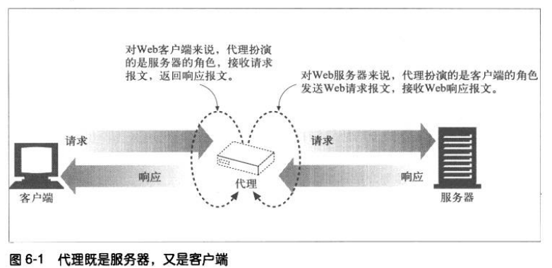

### 代理与网关的对比
代理连接的是多个使用相同协议的程序，而网关连接的是多个使用不同协议的端点。网关扮演的是“协议转换器”的角色，即使客户端和服务器使用的是不同的协议，客户端也可以通过它完成与服务器之间的事务处理。

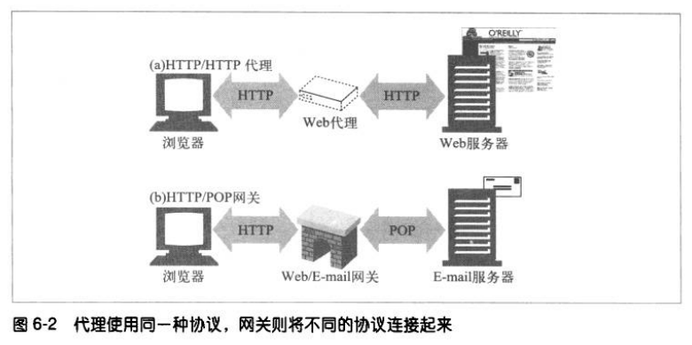

实际上，代理和网关的区别很模糊，由于浏览器和服务器实现的是不同版本的 HTTP，代理也经常要做一些转换协议的工作。

## 为什么使用代理
代理服务器可以改善安全性、提高性能、节省费用，还可以监视流量并对其进行修改。这里列举一些功能：
1. 过滤器，过滤一些不允许访问的内容，例如成人网站。
2. 文档访问控制，针对不同的用户创建不同的访问控制策略。
3. 安全防火墙，代理服务器可以限制某些应用层协议的数据流入或流出。

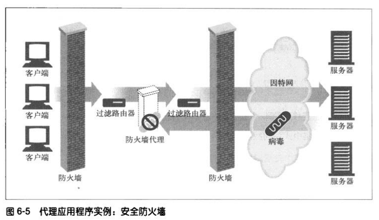

4. Web 缓存，代理缓存了常用文档的本地副本，并将它们按需提供，以减少缓存且昂贵的通信。
5. 反向代理，代理可以假扮服务器。反向代理接收请求，然后发给其他真正处理请求的服务器，最后把结果转发回给客户端。可以用这些反向代理来提高访问慢速服务器上公共内容时的性能，在这种情况下，反向代理可称为服务器加速器。
6. 内容路由器，代理可作为内容路由器使用。根据因特网流量状况以及内容类型将请求导向特定的服务器。
7. 转码器，代理服务器在将内容发给客户端之前，可以修改内容的主体格式。在这些数据之间进行的透明转换被称为转码。例如在传输 GIF 图片时，将其转换为 JPEG 图片，以减小尺寸。
8. 匿名者，匿名者代理会主动从 HTTP 报文中删去身份特性（例如客户端的 IP 地址、From 首部、Referer 首部、cookie），从而提供高度的私密性和匿名性。

## 代理会去向何处
### 代理服务器的部署
可以根据其目标用途，将代理放在任意位置：
1. 出口代理，将代理固定在本地网络的出口点，以便控制本地网络与因特网之间的流量。
2. 访问（入口）代理，代理常被放在 ISP 访问点上，用以处理来自客户的聚合请求。
3. 反向代理，反向代理通常被部署在网络边缘，在那里它们可以处理所有传送给服务器的请求，并只在必要时向服务器请求资源。反向代理通常会冒用服务器的名称和 IP 地址，这样所有的请求都会发给反向代理而不是服务器。
4. 网络交换代理，可以将具有足够处理能力的代理放在网络之间的因特网对等交换点上，通过缓存来减轻因特网节点的拥塞，并对流量进行监视。

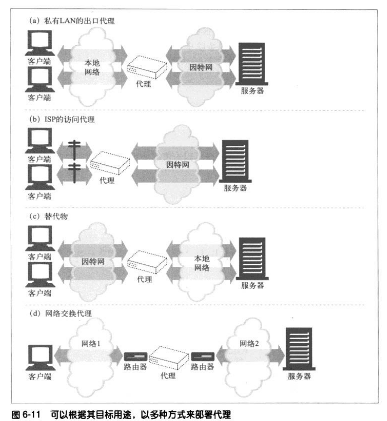

### 代理的层次结构
可以通过代理层次结构将代理级联起来。下一个入口代理（靠近服务器）被称为父代理，下一个出口代理（靠近客户端）被称为子代理。


上图中代理的层次结构是静态的——代理 1 总是把报文传给代理 2，代理 2 总是把报文传给代理 3。但是，层次也可以是动态的。代理可以根据不同的因素，将报文传给一个不断变化的代理服务器和原始服务器集。

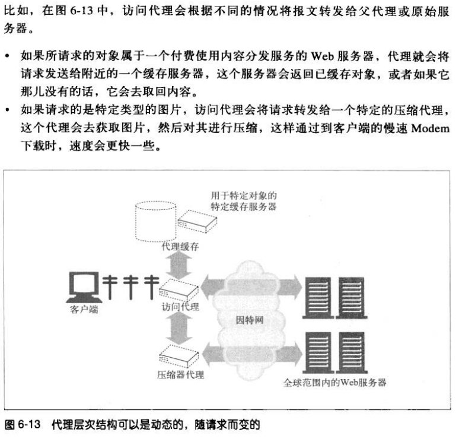

这里还有几个动态选择父代理的例子：
1. 负载均衡，子代理根据当前父代理上的工作负载级别来决定如何选择一个父代理，以均衡负载。
2. 地理位置附近的路由，子代理可能会选择负责原始服务器所在物理区域的父代理。
3. 协议/类型路由，子代理可能会根据 URI 将报文转发到不同的父代理和原始服务器上去。
4. 基于订购的路由，如果发布者为高性能服务额外付费了，它们的 URI 就会被转发到大型缓存或压缩引擎上去，以提高性能。

### 代理如何获取流量
有四种常见的方式可以使客户端流量流向代理：
1. 修改客户端，很多浏览器可以配置代理，如果将客户端配置为使用代理服务器，客户端就会将 HTTP 请求直接地发送给代理而不是服务器。
2. 修改网络，网络基础设施可以通过技术手段将 HTTP 流量导入到一个代理。这种代理被称为拦截代理。
3. 修改 DNS 的命名空间。
4. 修改服务器，可以将某些服务器配置为向客户端发送一个 HTTP 重定向命令，将客户端请求重定向到一个代理上去。

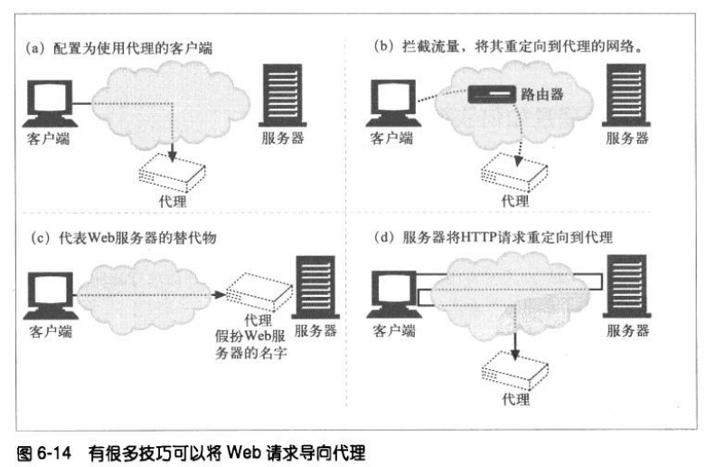

## 客户端的代理设置
浏览器配置代理方式：
1. 手工配置，显式地设置要使用的代理。
2. 预先配置浏览器，浏览器厂商或发行商预先对浏览器的代理设置进行手工配置。
3. 代理的自动配置，提供一个指向 JS 语言编写的代理自动配置文件的 URI，客户端会取回这个文件，运行并决定是否使用一个代理。
4. WPAD 的代理发现，有些浏览器支持 Web 代理自动发现协议。

### 客户端代理配置：PAC 文件
PAC 文件是一些小型的 JS 程序，可以在运行过程中计算代理设置。访问每个文档时，JS 函数都会选择恰当的代理服务器。
每个 PAC 文件都得定义一个叫 `FindProxyForURL(url, host)` 的函数，用来计算访问 URI 时使用的适当的代理服务器。返回值可以是下表列出的任意值。


### 客户端代理配置：WPAD 文件
有些浏览器的配置机制是 WPAD 协议，WPAD 协议会自动地寻找 PAC 文件。

## 与代理请求有关的一些棘手问题
### 代理 URI 和服务器 URI 的不同
客户端向服务器而不是代理发送请求时，HTTP 请求报文中的 URI 会有所不同。
客户端向服务器发送请求时，请求行中只包含部分 URI（没有方案、主机、端口），如下例所示：
```
GET /index.html HTTP/1.0
User-Agent: SuperBrowser v1.3
```
但当客户端向代理发送请求时，请求行中则包含完全的 URI：
```
GET http:/test.com/index.html HTTP/1.0
User-Agent: SuperBrowser v1.3
```
因为在原始的设计中，客户端和服务器直接进行对话，不存在代理。所以为了避免冗余信息，客户端只需发送部分 URI 即可，无需方案、主机、端口。
代理出现之后，使用部分 URI 就有问题了。代理需要知道目标服务器的名称，这样它才能与服务器建立连接。

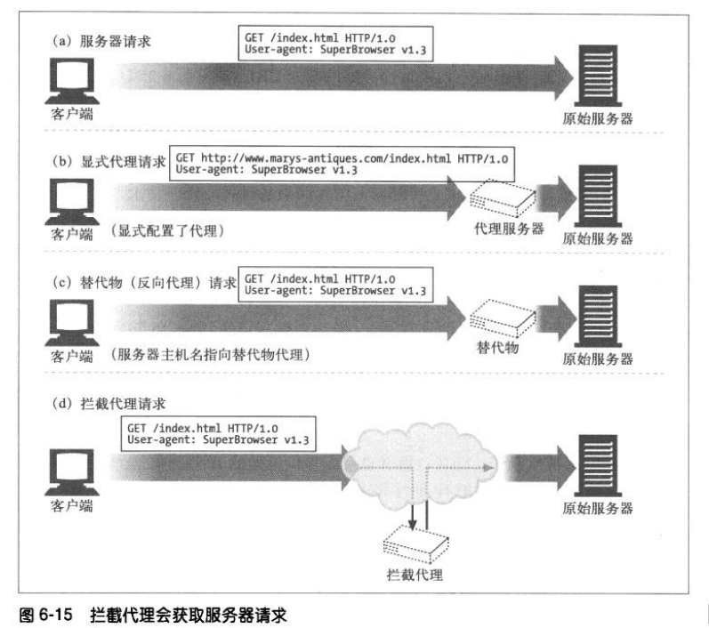

### 代理既可以处理代理请求，也可以处理服务器请求
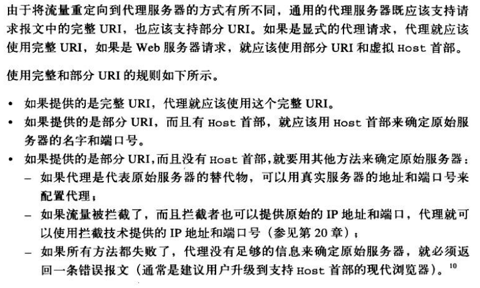

## 追踪报文
### Via
Via 是一个通用首部，是由代理服务器添加的，适用于正向和反向代理，在请求和响应首部中均可出现。这个消息首部可以用来追踪消息转发情况，防止循环请求，以及识别在请求或响应传递链中消息发送者对于协议的支持能力。

Via 字段：
1. 协议名，如果协议名是 HTTP ，那就是可选的，否则就要在版本前面加上协议名，中间用 “/” 分隔。
2. 协议版本
3. 节点名
4. 节点注释

### TRACE 方法
HTTP/1.1 的 TRACE 方法可以跟踪经代理链传输的请求报文，观察报文经过了哪些代理，以及每个代理是如何对请求报文进行修改的。TRACE 对代理流的调试非常有用。
当 TRACE 请求到达目的服务器时，整条请求报文都会被封装在一条 HTTP 响应报文的主体中回送给发送端。TRACE 响应的 Content-Type 为 message/http，状态为 200 OK，代理列表在 Via 首部可以看到。

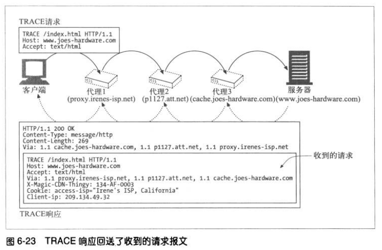

#### Max-Forwards
Max-Forwards 首部用来限制 TRACE 和 OPTIONS 请求所经过的代理跳数。如果值为 0，那么接收者即使不是原始服务器也要把 TRACE 报文回送给客户端。

## 代理认证
HTTP 定义了一种名为代理认证的机制，这种机制可以阻止对内容的请求，直到用户向代理提供了有效的访问权限证书为止。

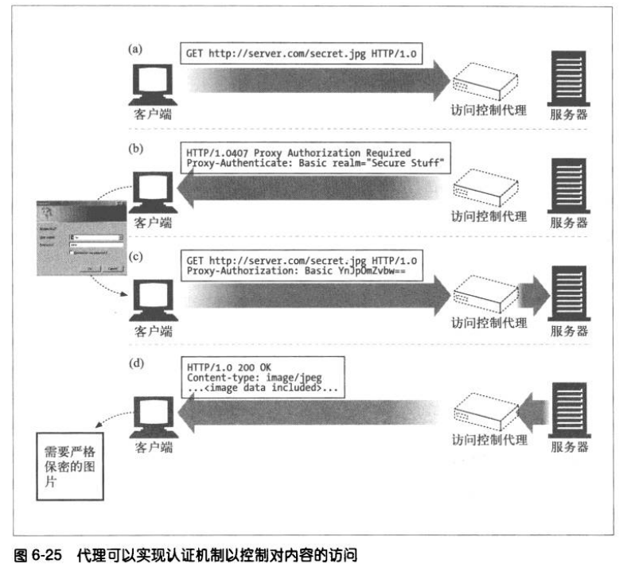

## 代理的互操作性
### 处理代理不支持的首部和方法
代理服务器可能无法理解所有经其传输的首部字段，代理必须对不认识的首部字段进行转发，必须维持同名首部字段的相对顺序。

### OPTIONS：发现对可选特性的支持
通过 HTTP OPTIONS 方法，客户端可以检查服务器是否支持某个功能。客户端在与服务器建立连接之前，通过使用 OPTIONS 可以确定服务器的能力。
这样它就可以更方便地与不同特性的代理和服务器进行互操作了。

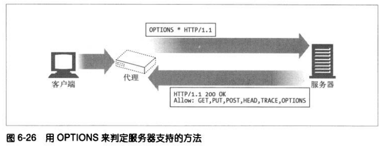

如果 OPTIONS 请求的 URI 是个星号（*），请求的就是整个服务器所支持的功能。
```
OPTIONS * HTTP/1.1
```
如果 URL 是个实际资源地址，请求的就是在查询那个特定资源的可用特性。
```
OPTIONS http://test.com HTTP/1.1
```
如果成功，OPTIONS 方法就会返回一个包含了各种首部字段的 200 OK 响应，这些字段是服务器所支持的，或资源可用的各种可选特性。
HTTP/1.1 在响应中唯一指定的首部字段是 Allow 首部，这个首部用于描述服务器所支持的各种方法（或者服务器上的特定资源）。

### Allow 首部
Allow 实体首部字段列出了请求 URI 标识的资源所支持的方法列表，如果 URI 为 * 的话，列出的就是整个服务器所支持的方法列表。如：
```
Allow: GET, HEAD, PUT
```