# IP 文档
* [IP 数据报格式](#IP-数据报格式)
* [IP 转发分组流程](#IP-转发分组流程)
* [IP 地址](#IP-地址)
* [路由选择协议](#路由选择协议)
* [路由器的构成](#路由器的构成)
* [IPv6](#IPv6)
* [IP 多播](#IP-多播)
* [虚拟专用网络 VPN 和网络地址转换 NAT](#虚拟专用网络-VPN-和网络地址转换-NAT)
* [MPLS 多协议标记交换](#MPLS-多协议标记交换)

仅在网络层提供连接服务的计算机网络称为**虚电路**，仅在网络层提供无连接服务的计算机网络称为**数据报网络**。

因特网属于数据报网络，还有许多其他网络体系结构属于虚电路（ATM、帧中继的体系结构）。

网络层向上提供简单灵活的、无连接的、尽最大努力交付的数据报服务。网络层不用先建立连接，不提供服务质量的承诺。
分组不进行编号，并且所传送的分组有可能丢失、出错、重复和失序，也不保证交付时限。


#### 网络层两种重要的功能：
1. 转发 将分组从路由器的入链路转发到出链路。
2. 路由选择 当分组从发送方流向接收方时，网络层必须决定这些分组所采用的路由或路径。

#### 将网络互相连接起来的中间设备
1. 物理层使用的中间设备叫做转发器。
2. 数据链路层使用的中间设备叫做网桥或桥接器。
3. 网络层使用的中间设备叫路由器。
4. 在网络层以上使用的中间设备叫网关。

## IP 数据报格式


1. 版本，4位，现在使用的版本有 IPv4、IPv6。
2. 首部长度，4位，常用首部长度为 20 字节，当首部长度不是 4 的整数倍时，需要填充字节。
3. 区分服务（TOS），8位，用来获得更好的服务，一般不使用。
4. 总长度，16位，首部长度 + 数据长度，最大为 2**16 - 1 = 65535 字节。
5. 标识，16位，IP 软件维持一个计数时，每产生一个数据报，计数器就加 1。当数据报长度超过网络的 MTU 而必须分片时，标识字段的值会被复制到所有的分片的标识字段中，为了最后能正确地重装为原来的数据报。
6. 标志，3位，最低位 MF = 1 时，表示后面还有分片，MF = 0 时，表示这是最后一个分片。中间的一位为 DF，DF = 1 时，表示不能分片， DF = 0 时，表示允许分片。
7. 片偏移，13位，分组在分片后，某分片在原分组中的相对位置，即相对于数据字段的起点，该片从何处开始。片偏移以 8 个字节为偏移单位，即分片长度为 8 字节的整数倍。


8. 生存时间，8位，英文缩写 TTL，最大值为 255。路由器每次转发数据报之前，把 TTL 减 1，若减到为 0，则丢弃这个数据报。
9. 协议，8位，指出此数据报携带的数据使用何种协议，以便目的主机的 IP 层知道应将数据部分上交给哪个协议进行处理。


10. 首部检验和，16位，只检验数据报的首部字段，不包括数据部分，每经过一个路由器都要重新计算首部校验和。
11. 源地址，32位。
12. 目的地址，32位。
13. 选项字段，用来支持排错、测试以及安全等措施。

[回到顶部](#IP-文档)
## IP 转发分组流程
在路由表中，对每一条路由最重要的信息是：（目的网络地址，下一跳地址）。
在互联网上的交付有两种：在本网络的直接交付，到其他网络的间接交付。

路由器转发分组流程：
1. 从数据报首部提取出目的主机的 IP 地址 D，得出目的网络地址为 N。
2. 若 N 是路由器直接相连的某个网络，则进行直接交付（直接把数据报交给目的主机），否则就是间接交付，执行 3。
3. 若路由表中有目的地址为 D 的特定主机路由或到达网络 N 的路由，则把数据报交给表中所指明的下一跳路由器，否则执行 4。
4. 若路由表中有默认路由，则把数据报交给表中指明的默认路由器，否则执行 5。
5. 报告转发分组出错。

#### 与 IP 协议配套使用的还有三个协议：
1. 地址解析协议 ARP。
2. 网际控制报文协议 ICMP。
3. 网际组管理协议 IGMP。


[回到顶部](#IP-文档)
## IP 地址
IP 地址由网络号和主机号组成，它是分等级的地址结构。分等级有两个好处：
1. IP 地址管理机构在分配地址时只分配网络号，主机号由该网络号的单位自行分配，管理方便。
2. 路由器仅根据目的地址的网络号来转发分组，这样可以减少路由表中的项目数。

### IP 地址的编址方法经历了三个阶段
1. 分类的 IP 地址。
2. 子网的划分。
3. 构成超网。

### 地址分类
A B C 类地址是单播地址（一对一），D类地址为多播地址（一对多），E类地址保留，每一类地址由两个固定长度的字段组成。
1. 网络号，它标志主机或路由器所连接到的网络。
2. 主机号，它标志主机或路由器。
```
IP 地址 = {网络号,主机号}
```
一个网络是指具有相同网络号的主机的集合，因此用转发器或网桥连接起来的若干个网络仍为同一个网络。

注意，近年来已经广泛使用无分类 IP 地址进行路由选择，A B C 类地址的区分已成为历史。

IP 地址中全 0 表示这个（this），网络号字段全 0 的 IP 地址是个保留地址，意思是本网络。

全 0 的主机号字段表示该 IP 地址是本主机所连接到的单个网络地址（5.6.7.8 该主机所在的网络地址就是 5.0.0.0），全 1 的主机号字段表示该网络上的所有主机。

网络号为 127 保留作为本地软件环回测试本主机的进程之间的通信之用。若主机发送一个目的地址为环回地址的 IP 数据报，则不会把数据报发送到任何网络。
网络号为 127 的地址永远不会出现在网络上，因为它不是一个网络地址。

#### A 类地址
A 类地址主机号占 3 个字节。最大主机数为 2**24 - 2，A 类地址空间约占整个 IP 地址空间的 50%。
#### B 类地址
B 类地址主机号占 2 个字节，最大主机数为 2**16 - 2，B 类地址空间约占整个 IP 地址空间的 25%。
#### C 类地址
C 类地址主机号占 1 个字节，最大主机数为 2**8 - 2，C 类地址空间约占整个 IP 地址空间的 12.5%。


#### 其他特点
1. IP 地址标志着一台主机（或路由器）和一条链路的接口。
2. 路由器具有两个或以上的 IP 地址。
3. 两个路由器直连的特殊网络通常不分配地址，这样的特殊网络叫无编号网络或无名网络。
4. IP 地址放在 IP 数据报首部，硬件地址（MAC）放在 MAC 帧的首部。
5. IP 数据报中的源和目的地址始终不变，MAC 帧中的源和目的地址在不同的网络上都会变化。


### 子网划分
划分子网的方法是从网络的主机号借若干位用作子网号，主机号也相应减少同样的位数。于是两级 IP 地址变成三级 IP 地址。
```
IP 地址 = {<网络号>, <子网号>, <主机号>}
```
单位路由器接收到外网的 IP 数据报后，根据网络号和子网号找到目的子网，再交给对应的主机。

#### 子网掩码
假如一个 IP 数据报（目的地址 145.13.3.10）到达了路由器，怎么分辨这个目的主机所连的网络是否进行了子网划分？
不管有没有进行子网划分，只要把 IP 地址和子网掩码进行按位与，就能得到网络地址。


所有的网络都必须使用子网掩码。
1. A 类地址默认子网掩码 255.0.0.0
2. B 类地址默认子网掩码 255.255.0.0
3. C 类地址默认子网掩码 255.255.255.0

#### 使用子网时分组的转发
使用子网后，路由表必须包括：目的网络地址、子网掩码、下一跳地址。

使用子网时转发分组流程：
1. 从数据报首部提取出目的主机的 IP 地址 D。
2. 对路由器直接相连的网络进行这样的操作：用各网络的子网掩码与 D 按位与，得出网络地址，看这个地址是否与相应的网络地址匹配，若匹配则直接交付，否则执行 3。
3. 若路由表中有目的地址为 D 的特定主机路由，则把数据报交给表中所指明的下一跳路由器，否则执行 4。
4. 对路由表中的每一行信息（目的网络地址，子网掩码，下一跳地址），用其中的子网掩码与 D 按位与，得出网络地址 N。若 N 与该行的目的网络地址匹配，则把数据报交给该行指明的下一跳路由，否则执行 5。
5. 若路由表中有默认路由，则把数据报交给表中指明的默认路由器，否则执行 6。
6. 报告转发分组出错。

### 无分类编址，构造超网

#### 网络前缀
无分类域间路由选择（CIDR）:
1. 消除了地址分类以及划分子网的概念，把 32 位 IP 地址分为前后两部分。
```
IP 地址 = {<网络前缀>, <主机号>}
```
CIDR 使三级编址又回到了两级编址，但这是无分类编址。CIDR 使用斜线记法，在 IP 地址后面加上 “/”，然后写上网络前缀的位数（10.0.0.0/10）。

2. CIDR 把网络前缀都相同的 IP 地址组成一个 CIDR 地址块。知道这个地址块中的任意一个地址，就能知道地址块的起始地址和最大地址、地址数量。


3. CIDR 使用 32 位的地址掩码，其中 1 的个数就是网络前缀的长度。
4. 由于 CIDR 地址块包含很多地址，所以在路由表中就利用 CIDR 地址块查找目的网络，这种地址的聚合称为路由聚合。

#### 最长前缀匹配（最佳匹配）
使用 CIDR 时，路由表项目由网络前缀和下一跳地址组成，但在查找时可能会匹配到不止一个结果，这时要采用最长前缀匹配。

[回到顶部](#IP-文档)
## 路由选择协议
根据路由算法是否能随网络变化而自适应地调整来分类，可分为静态路由选择策略（非自适应）和动态路由选择策略（自适应）。

### 自治系统 AS
自治系统 AS 是在单一技术管理下的一组路由器，整个互联网划分为很多较小的自治系统。在目前的互联网中，一个大的 ISP 就是一个自治系统。

自治系统内的路由选择叫域内路由选择，自治系统之间的路由选择叫域间路由选择。

这样可以把路由选择协议分为内部网关协议和外部网关协议。

1. 内部网关协议 IGP

即在一个 AS 内使用的路由选择协议，目前使用的协议有多种，如 RIP 和 OSPF 等（这两个都是分布式路由选择协议）。

2. 外部网关协议 EGP

两个 AS 之间需要传递信息时，就需要一种协议将路由选择信息传递到另一个 AS，这样的协议就是外部网关协议。
目前使用的协议只有 BGP。

### RIP
RIP 是一种分布式的基于距离向量的路由选择协议，是互联网的标准协议，最大优点是简单。
RIP 要求网络中的每个路由器都得维护从它自己到其他每一个目的网络的距离记录。

#### 距离（跳数）
1. 从路由器到直接连接的网络距离为 1。
2. 从路由器到非直接连接的网络的距离定义为所经过的路由器加 1。

RIP 允许一条路径最多包含 15 个路由器，即距离等于 16 时相当于不可达，可见 RIP 只适用于小型网络。

RIP 不能在两个网络之间同时使用多条路由，它只选择一条具有最少路由器的路由，哪怕还存在一条高速但路由器较多的路由。

#### 特点
1. 仅和相邻路由器交换信息。
2. 路由器交换的信息是本路由器所知道的全部信息，即自己现在的路由表（到本自治系统中所有网络的最短距离的信息，以及到每个网络应经过的下一跳路由器）。
3. 按固定时间间隔交换路由信息，当网络拓扑发生变化时，也会及时向相邻路由器通告拓扑变化后的路由信息。

一般情况下，RIP 协议可以收敛，并且过程也较快。**收敛**是指自治系统内所有结点都得到正确的路由选择信息的过程。

RIP 存在的一个问题是，当网络出现故障时，要经过比较长的时间才能将路由信息传送到所有的路由器。

RIP 最大的优点是实现简单，开销小。

RIP2 支持变长子网掩码和无分类域间路由选择 CIDR，此外还提供简单的鉴别过程支持多播。

#### 距离向量算法
路由表的更新原则是找出到每个目的网络的最短距离，这种更新算法又叫距离向量算法。

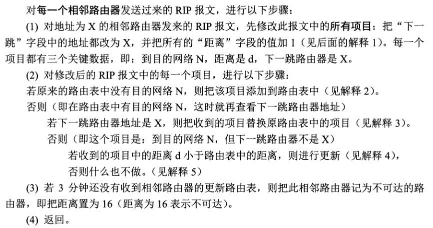

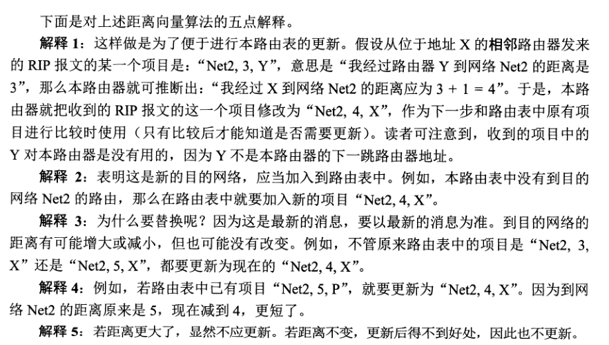

#### RIP 报文格式
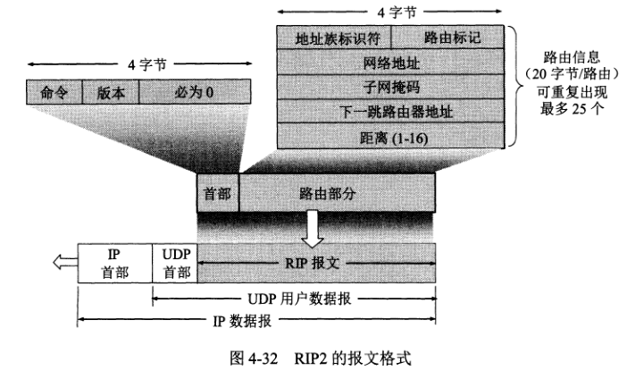

RIP 协议使用 UDP 进行传送（端口 520）。

### OSPF 协议（开放最短路径优先）
OSPF 最主要的特征是使用分布式的链路状态协议，而不是像 RIP 那样的距离向量协议。OSPF 的三个要点和 RIP 的都不一样：
1. 向本自治系统的所有路由器发送信息使用的是洪泛法。
2. 发送的信息是与本路由器相邻的所有路由器的链路状态（只是本路由器知道的部分信息）。链路状态是指本路由器都和哪些路由器相邻，以及该链路的度量。
3. 只有当链路状态发生变化时，路由器才向所有路由器使用洪泛法发送此信息。不像 RIP，有无信息都要定期交换路由表信息。

由于各路由器频繁的交换链路状态信息，最终所有路由器都能建立一个链路状态数据库，实际上就是全网拓扑结构图。

OSPF 的链路状态数据库能较快地进行更新，使各个路由器能及时更新其路由表，OSPF 的更新过程收敛快是其重要优点。

#### 层次结构的区域划分
1. OSPF 还可以将自治系统细分为一个个区域，在区域内部的路由器只知道本区域的完整拓扑结构。
2. 在上层的区域叫主干区域（标识为 0.0.0.0），主干区域的作用是连通其他下层区域，区域之间通过区域边界路由器通信。
3. 每个区域至少有一个区域边界路由器，在主干区域内的路由器称为主干路由器。
4. 在主干区域还要有一个路由器和其他自治系统交换路由信息，这样的路由器被称为自治系统边界路由器。

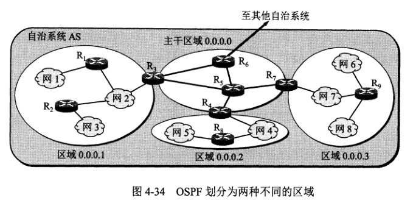

#### OSPF 报文格式
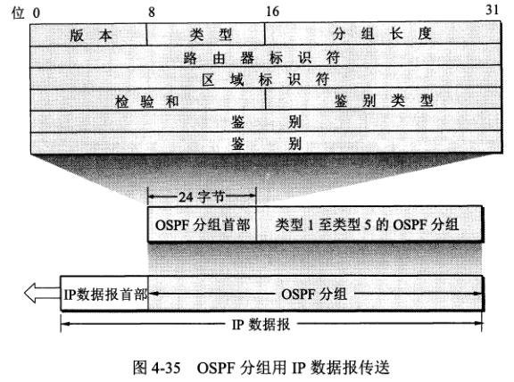

1. 版本 当前为2。
2. 类型 可以是五种类型之一。
3. 分组长度 总长度。
4. 路由器标识符 标志发送该分组的路由器的接口的 IP 地址。
5. 区域标识符 分组属于的区域的标识符。
6. 检验和 用于检测分组中的差错。
7. 鉴别类型 0（不用） 1（口令）。
8. 鉴别 鉴别类型为 0 时，就填入 0；类型为 1 时，填入 8 个字符的口令。

OSPF 直接使用 IP 数据报传送，IP 数据部首部的协议字段值为 89，OSPF 构成的数据报很短。
#### 其他特点
1. OSPF 允许为每条路由指派不同的代价。
2. 如果到同一目的网络有多条相同代价的路径，那么可以将通信量分给这几条路径，这叫多路径间的负载平衡。
3. 所有在 OSPF 路由器之间交换的分组都具有鉴别功能，保证了仅在可依赖的路由器之间交换链路状态信息。
4. OSPF 支持可变长子网划分和 CIDR。
5. 链路状态的序号为 32 位，序号越大状态越新，序号增长的速率不能超过 5 秒钟 1 次。

#### OSPF 分组类型
1. 类型 1，问候（Hello）分组，用于发现和维持邻站的可达性。
2. 类型 2，数据库描述分组，向邻站给出自己的链路状态数据库中的所有链路状态项目的摘要信息。
3. 类型 3，链路状态请求分组，向对方请求发送某些链路状态项目的详细信息。
4. 类型 4，链路状态更新分组，用洪泛法对全网更新链路状态。
5. 类型 5，链路状态确认分组，对链路更新分组的确认。

OSPF 每两个相邻路由器每隔 10 秒要交换一次问候分组，这样能确知哪些邻站是可达的。
若 40 秒没有收到某个相邻路由器的问候分组，则可认为该路由器是不可达的，应立即修改链路状态数据库，并重新计算路由表。

两个同步的路由器叫“完全邻接的”路由器，不是完全邻接的路由器表明它们虽然在物理上是相邻的，但其链路状态数据库并没有达到一致。

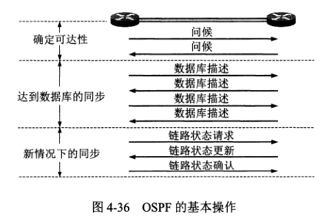

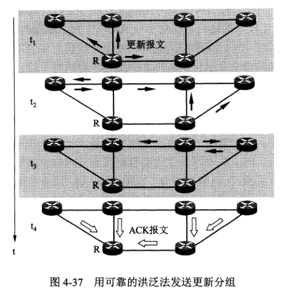

### BGP 边界网关协议
由于各种原因，BGP 只能力求寻找一条能够到达目的网络且比较好的路由（不能兜圈子），而并非寻找一条最好的路由。

BGP 采用路径向量路由选择协议。

在配置 BGP 时，每个 AS 的管理员要至少选择一个路由器作为该 AS 的 “BGP 发言人”。
BGP 发言人要与其他 AS 的 BGP 发言人沟通，需要通过 TCP 连接（端口 179）。

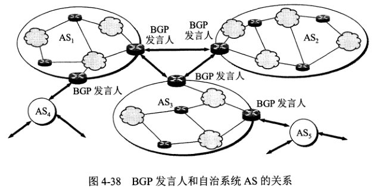

#### BGP 报文格式
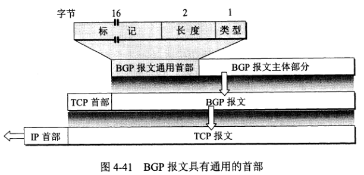

#### BGP 的 4 种报文
1. OPEN（打开），用来与相邻的另一个发言人建立关系，使通信初始化。
2. UPDATE（更新），用来通告某一路由的信息，以及列出要撤销的多条路由。
3. KEEPALIVE（保持），用来周期性地证实邻站的连通性。
4. NOTIFICATION（通知），用来发送检测到的差错。

[回到顶部](#IP-文档)
## 路由器的构成
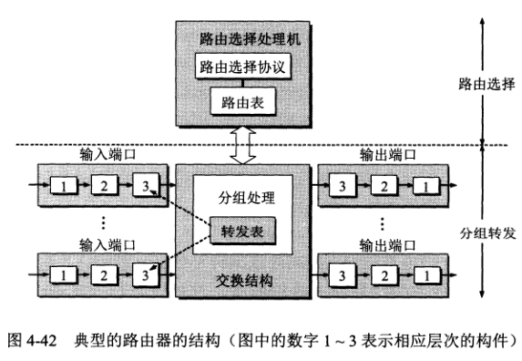

路由器是一种具有多个输入端口和输出端口的的专用计算机，其任务是转发分组。
整个路由器结构可分为路由选择部分和分组转发部分。

#### 路由选择部分
选择部分也叫控制部分，其核心构件是路由选择处理机。路由选择处理机的任务是根据所选定的路由选择协议构造路由表，同时和相邻路由器交换路由信息而更新、维护路由表。

#### 分组转发部分
分组转发部分可分成三部分：
1. 交换结构

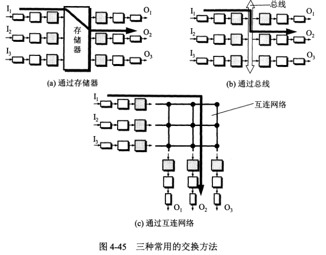

作用是根据转发表对分组进行处理，转发。转发和路由选择是有区别的。

**转发**就是路由器根据转发表把 IP 数据报从路由器合适的端口转发出去，转发仅涉及一个路由器。

**路由选择**涉及很多路由器，路由表是众多路由器协同工作的结果，而转发表是从路由表得出的。


2. 输入端口

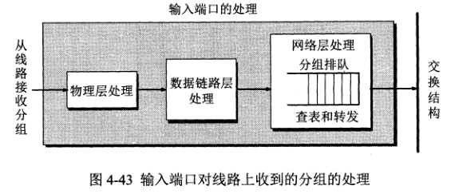

输入端口中的查找和转发功能在路由器的交换功能中是最重要的，每一个输入端口都有转发表的副本。
一旦查找确定了某分组的输出端口，则该分组就能够进入交换结构。

3. 输出端口

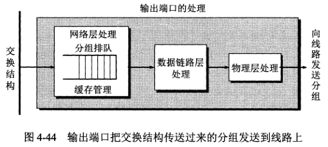

输出端口从交换结构接收分组，然后发送到路由器外面的线路上。

[回到顶部](#IP-文档)

## IPv6
IPv6 主要变化：
1. 更大的地址空间，地址位数为 128 位。
2. 扩展的地址层次结构。
3. 灵活的首部格式，首部长度固定。
4. 改进的选项。
5. 允许协议继续扩充。
6. 支持即插即用（自动配置），因此不需要使用 DHCP。
7. 支持资源预分配，支持实时视像等要求保证一定的带宽和时延的应用。
8. 首部改为 8 字节对齐。

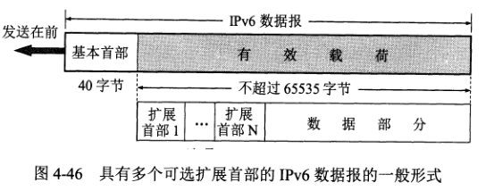

IPv6 数据报由基本首部和有效载荷组成，有效载荷允许有多个扩展首部，再后面是数据部分。

与 IPv4 相比，IPv6 对首部的某些字段进行了如下更改：
1. 取消了首部长度字段，因为首部长度固定为 40 字节。
2. 取消了服务类型字段，因为优先级和流标号实现了服务类型字段的功能。
3. 取消了总长度字段，改用有效载荷长度字段。
4. 取消了标识、标志和片偏移字段，因为这些功能已包含在分片扩展首部中。
5. 把 TTL 字段改称为跳数限制字段，但作用一样。
6. 取消了协议字段，改用下一个首部字段。
7. 取消了检验和字段，这样就加快了路由器处理数据报的速度。
8. 取消了选项字段，改用扩展首部来实现选项功能。

#### 报文格式
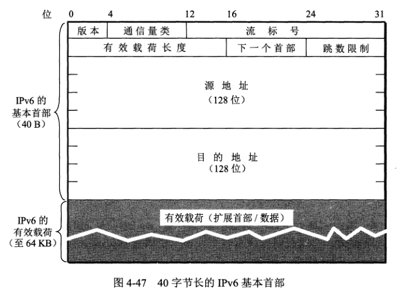

1. 版本，4位，该字段为 6。
2. 通信量类，8位，为了区分不同的 IPv6 数据报的类别或优先级。
3. 流标号，20位，属于同一个流的数据报都有同样的流标号。
4. 有效载荷长度，16位，指明数据报除基本首部以外的字节数。
5. 下一个首部，8位，相当于 IPv4 的协议字段或可选字段。
6. 跳数限制，8位。
7. 源地址，128 位。
8. 目的地址，128 位。

#### 6 种扩展首部
1. 逐跳选项。
2. 路由选择。
3. 分片。
4. 鉴别。
5. 封装安全有效载荷。
6. 目的站选项。

#### IPv6 地址
目的地址可分为三种基本类型：
1. 单播，一对一。
2. 多播，一对多。
3. 任播，终点是一组计算机，但数据报只交付其中的一个，通常是距离最近的一个。

IPv6 的主机和路由器称为结点，一个结点可以有多个单播地址，而其中任何一个地址都可以当成该结点的目的地址。

IPv6 地址使用冒号十六进制记法：
```
68E6:8C64:FFFF:FFFF:0:1180:960A:FFFF
```
可以把数字前面的 0 省略。另外，还允许零压缩，即一连串的 0 可以被一对冒号取替（零压缩只能使用一次）：
```
FF05:0:0:0:0:0:0:B3 = FF05::B3
```

#### 地址分类
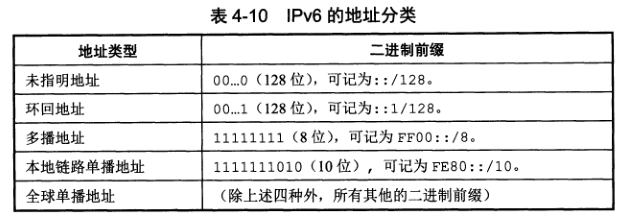


#### IPV4 过渡 IPv6
1. 双协议栈
2. 隧道技术

[回到顶部](#IP-文档)
## IP 多播
1. 在互联网上进行多播就叫 IP 多播，IP 多播所传送的分组需要使用 IP 多播地址。
2. 源只要把多播数据报发送一次，路由器在转发分组时会将收到的分组复制成多个副本再转发出去；
当分组到达目的局域网时，由于局域网具有硬件多播功能，因此不需复制分组，在局域网上的成员都能收到多播分组。
3. 与单播相比，在一对多的通信中，多播可大大节约网络资源。

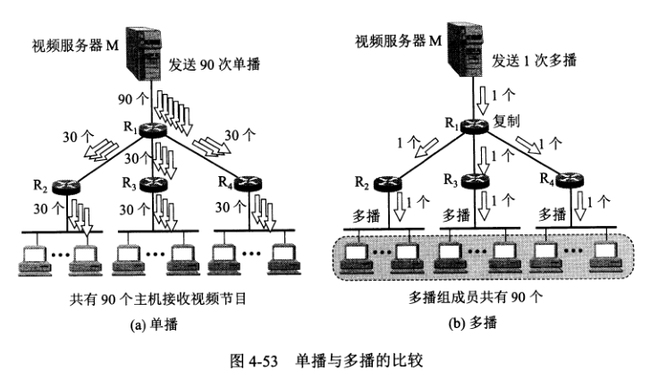

#### 多播组标识符
1. 多播数据报的目的地址写入的是多播组的标识符，然后设法让加入到这个多播组的主机的 IP 地址与多播组的标识符关联起来。
2. 多播组的标识符就是 IP 地址中的 D 类地址，前四位为 1110，因此 D 类地址范围是 224.0.0.0 - 239.255.255.255。
3. 多播地址只能用于目的地址，不能用于源地址。
4. 多播数据报和一般的 IP 数据报的区别就在于它使用 D 类 IP 地址作为目的地址，并且首部协议字段为 2，表明使用网际组管理协议 IGMP。
5. 多播数据报不产生 ICMP 差错报文，因此不能 PING 一个多播地址。

#### 局域网使用硬件多播
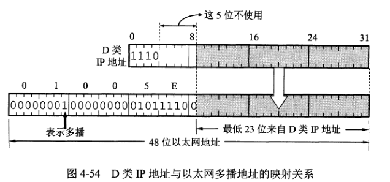

### 网际组管理协议 IGMP 和多播路由选择协议
IGMP 协议是让连接在本地局域网上的多播路由器知道本局域网上是否有主机（主机上的某个进程）参加或退出了某个多播组。
仅有 IGMP 协议不能完成多播任务，多播路由器还必须和互联网上的其他路由器进行协同工作，这就需要使用**多播路由器选择协议**。

多播数据报可以由没有加入多播组的主机发出，也可以通过没有组成员接入的网络。

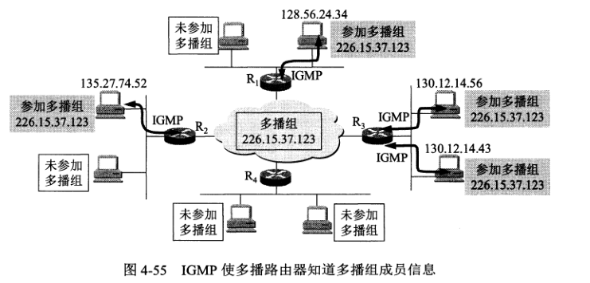
#### IGMP 工作阶段
1. 当某台主机加入多播组时，要向多播组的多播地址发送一个 IGMP 报文，声明要加入多播组。本地多播路由器收到报文后，还要利用多播路由选择协议把组成员关系转发给互联网的其他多播路由器。
2. 组成员关系是动态的。本地多播路由器要周期性的询问本地局域网上的主机，以便知道主机是否还是组成员。如果一个组经过几次探询后仍没有一台主机响应，则认为本网络上的主机都离开了这个组，因此也不再把这个组的成员关系转发给其他多播路由器。

#### IGMP 特点
1. 在主机和多播路由器之间的所有通信都使用 IP 多播，只要可能，携带 IGMP 报文的数据报都使用硬件多播。在支持硬件多播的网络上，没有参加 IP 多播的主机不会收到 IGMP 报文。
2. 多播路由器在探询组成员关系时，只需对所有的组发一个询问报文，而不需对每一个组发送一个询问报文，默认 125 秒一次。
3. 同一个组内的主机都要监听响应，只要有本组的其他主机发送了响应，自己就可以不再发送响应。 


#### 多播路由选择协议
多播路由选择实际上就是要找出以源主机为根节点的多播转发树。

多播路由选择协议转发多播数据报时使用以下三个方法：
1. 洪泛与剪除，为了避免兜圈子，采用了反向路径广播 RPB 的策略。

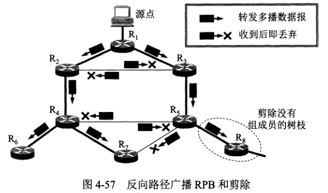

2. 隧道技术。

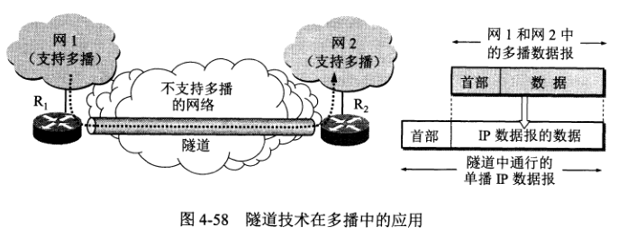

3. 基于核心的发现技术。

[回到顶部](#IP-文档)

## 虚拟专用网络 VPN 和网络地址转换 NAT
### VPN
在互联网中的所有路由器，对目的地址是专用地址的数据报一律不进行转发。

#### 专用地址（本地地址）
1. 10.0.0.0 - 10.255.255.255 (10.0.0.0/8 A 类网络)
2. 172.16.0.0 - 172.31.255.255 (172.16.0.0/12 B 类网络)
3. 192.168.0.0 - 192.168.255.255 (192.168.0.0/16 C 类网络)

这些地址仅在内部网络使用，专用地址也叫可重用地址。
#### VPN 建立过程
假定某个机构在相隔较远的场所建立了专用网 A 和 B，其网络地址分别为 10.1.0.0 和 10.2.0.0，现在这两个场所需要通过互联网构成一个 VPN。
每个场所都得有一个具有公网 IP 地址的路由器，当 A 和 B 要通信时，利用隧道技术将 A 和 B 要传送的数据报包装起来，到达目的地再将数据解包。

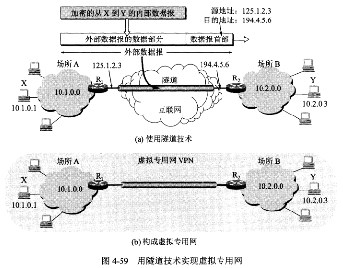
### NAT
要使用 NAT 必须在路由器上安装 NAT 软件，并且路由器至少拥有一个有效的公网 IP 地址。
这样，当内部网络要与互联网通信时，在 NAT 路由器上将其本地地址转换为公网地址，才能和互联网进行连接。

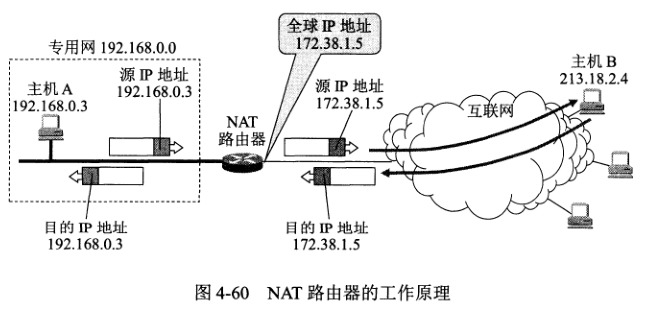


通过 NAT 路由器的通信必须由专用网内的主机发起。
内部网络的主机不能充当服务器用，因为互联网上的客户无法请求专用网络内的服务器提供服务（NAT 转换表上没有记录）。

#### NAPT
现在 NAT 转换表把运输层的端口号也使用上，这样就能使多个拥有本地地址的主机共用一个 NAT 路由器上的公网 IP 地址，因而可以同时与互联网上的不同主机通信。
使用端口号的 NAT 也叫做**网络地址与端口号转换 NAPT**，而不使用端口号的就是传统 NAT。


#### UPnP
UPnP 是一种允许主机发现并配置邻近 NAT 的协议，UPnP 要求主机和 NAT 都是 UPnP 兼容的。
UPnP 能让主机应用程序为某些公共端口号请求一个 NAT 映射，如果 NAT 接受请求并生成映射，则外部的结点能主动发起 TCP 连接。
也就是说该应用程序能够向外部世界通告它。

#### NAPT UPnP 区别
NAPT 通信必须由内网的主机发起，如果外网的主机要发起通信，当 IP 数据报到达 NAT 路由器时，由于没有映射关系，NAT 路由器不知道把数据报交给哪台主机。
所以使用 NAPT 的内部网的主机无法充当服务器。

UPnP 是解决被动通信问题，在当前通信状态下再打开一个端口供对方来连接。

[回到顶部](#IP-文档)

## MPLS 多协议标记交换
MPLS 采用面向连接技术，使每个分组携带一个叫做标记的小整数。当分组到达交换机（即标记路由器）时，交换机读取分组的标记，并利用标记值检索分组转发表。这种方式比查找路由表来转发分组快得多。

MPLS 作为一种 IP 增强技术，被广泛地应用在互联网中。MPLS 具有以下特点：
1. 支持面向连接的服务质量。
2. 支持流量工程，平衡网络负载。
3. 有效地支持虚拟专用网 VPN。

#### MPLS 工作原理
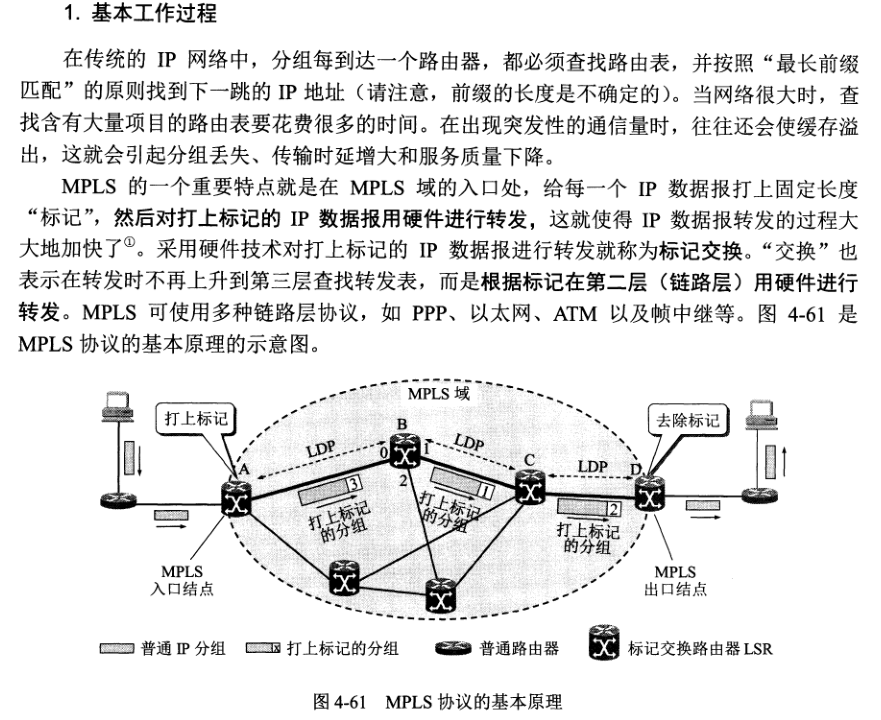

MPLS 域是指该域中有很多彼此相邻的路由器，并且都是支持 MPLS 技术的**标记交换路由器 LSR**。
LSR 同时具有标记交换和路由选择功能，标记交换是为了快速转发分组，但在这之前需要使用路由选择功能构造转发表。

#### 转发等价类 FEC
**转发等价类**就是路由器按照同样方式对待的 IP 数据报的集合。“按照同样方式对待”表示从同样接口转发到同样的下一跳地址，并且具有相同的服务类别和丢弃优先级等。
划分 FEC 的方法由网络管理员控制，入口结点将属于同样 FEC 的 IP 数据报都指派同样的标记，FEC 和标记是一一对应关系。

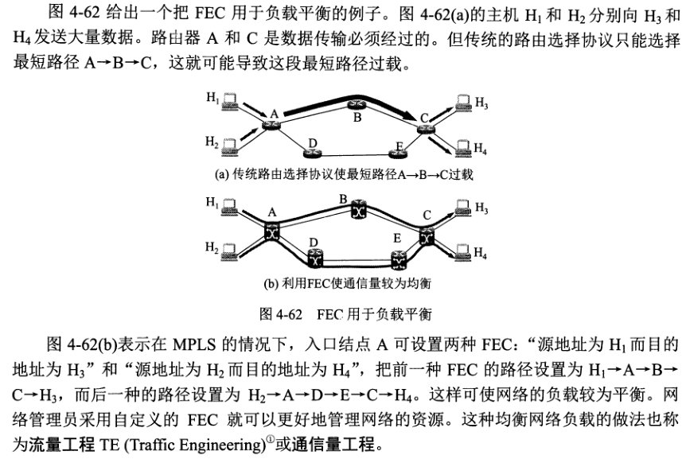

#### MPLS 报文格式
MPLS 在 IP 数据报封装成以太网帧之前，先要插入一个 4 字节的 MPLS 首部。从层次角度来看，MPLS 首部处在第二层和第三层之间。
这种以太网帧的类型字段在单播的情况下设置为 8847（16 进制），多播情况下设置为 8848（16 进制）。这样，接收方可以根据帧的类型来判断是否携带了 MPLS 标记。

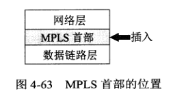

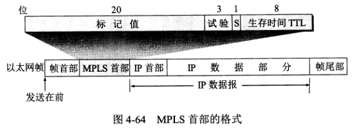

1. 标记值，20位。
2. 试验，3位。
3. 栈 S，1位。
4. 生存时间 TTL，8 位。

[回到顶部](#IP-文档)